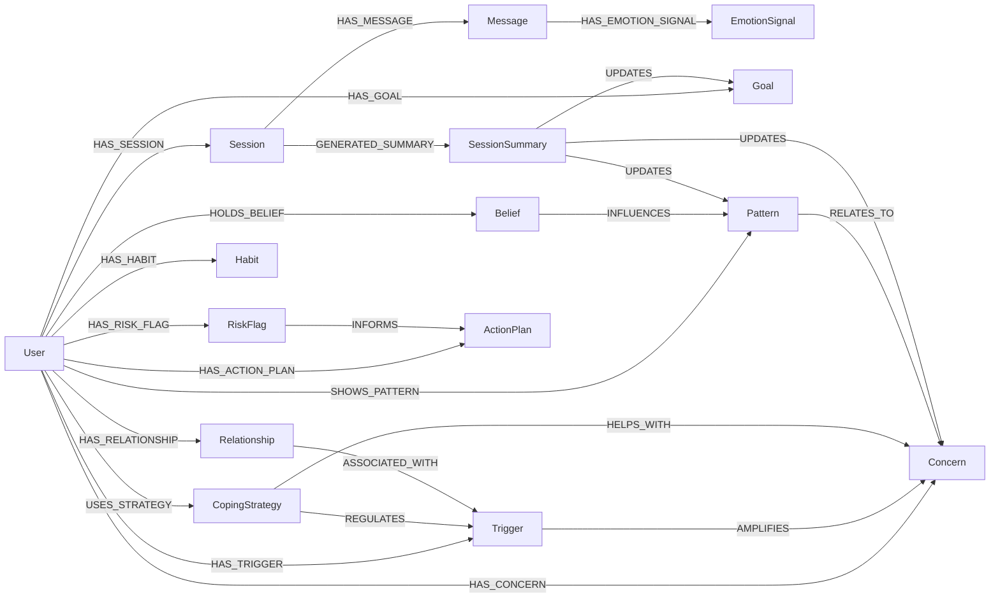
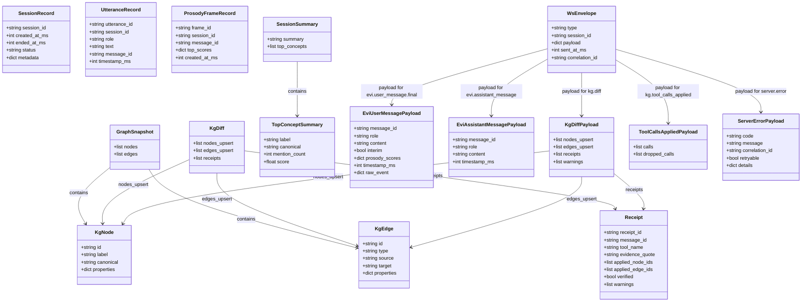
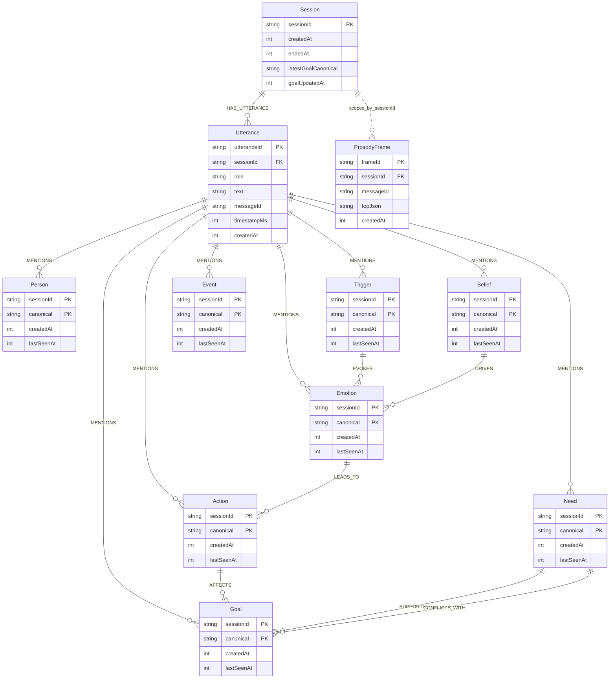
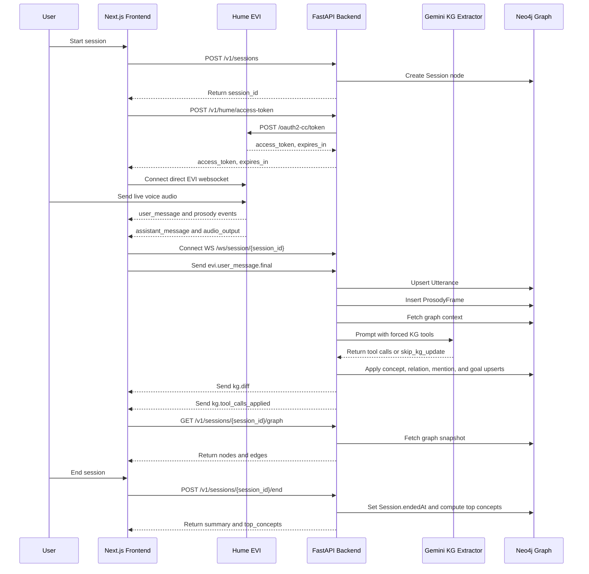

## Identity / structure

- `User`
    
- `Session`
    
- `Message`
    
- `SessionSummary`
    

## Emotional / therapeutic memory

- `EmotionSignal`
    
- `Concern`
    
- `Goal`
    
- `Trigger`
    
- `CopingStrategy`
    
- `Pattern`
    
- `Belief`
    
- `Habit`
    
- `Relationship`
    
- `Topic`
    

## Safety / guidance

- `RiskFlag`
    
- `ActionPlan`
    
- `Resource`
    
- `MoodTrend`
    

---

## Backend Contracts

_________

## Neo4j Session Graph

___________

## End to End runtime flow

