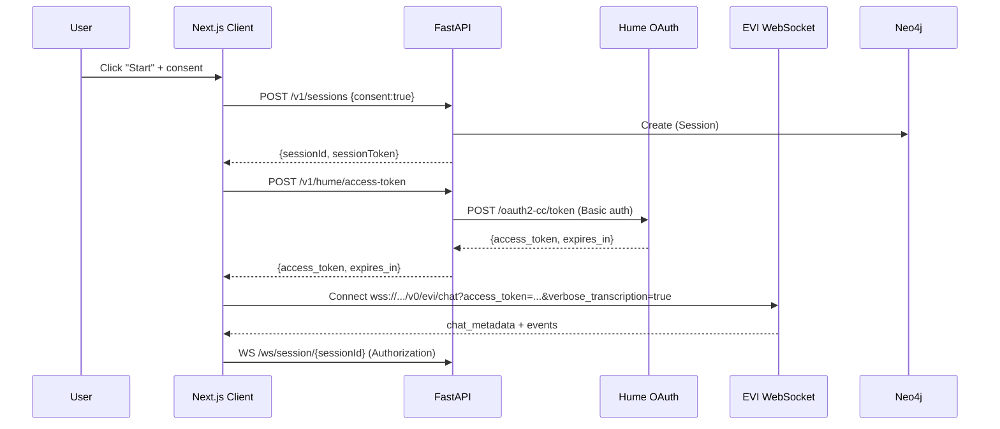
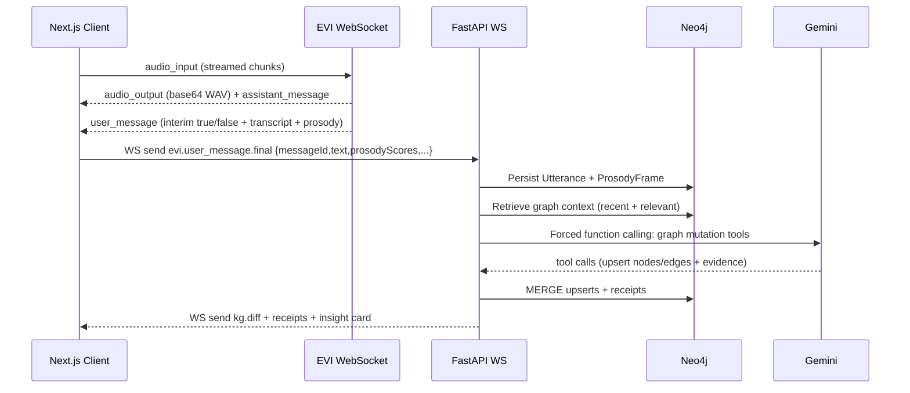
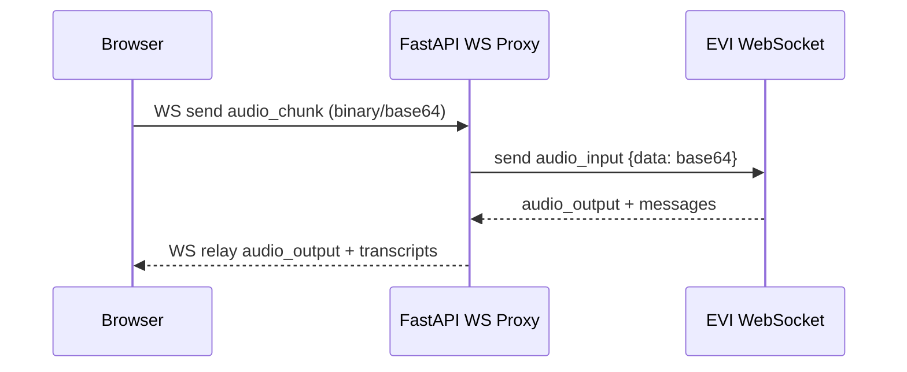
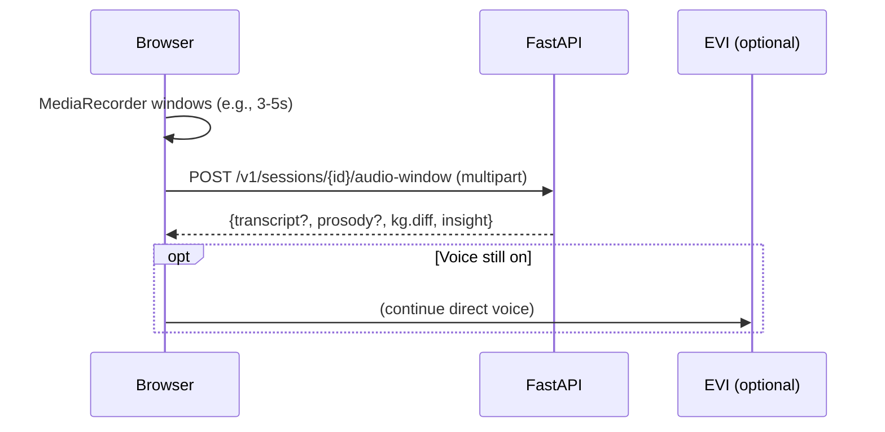
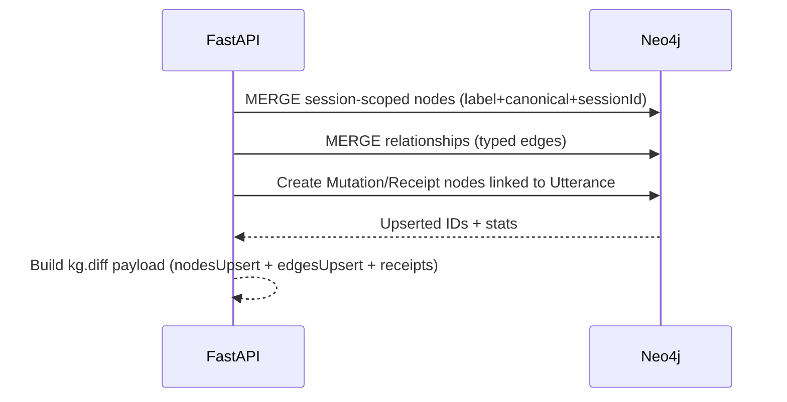
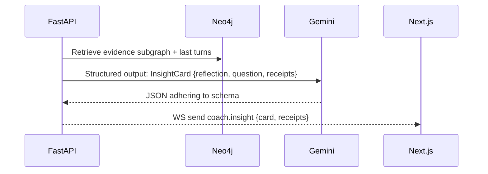
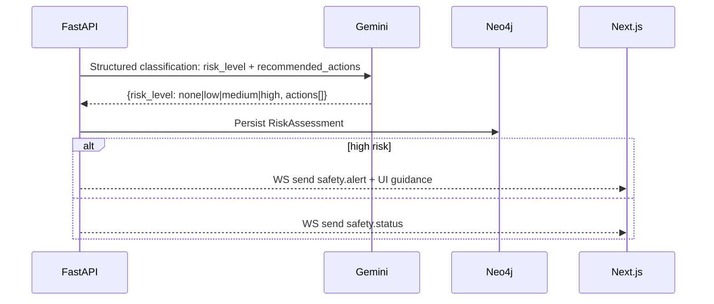

___________
## Session Start

_________

## Voice w/KG listener

_________
## Proxy through fastapi?

- could work since evi offers audioinput and audio output (but really this is optional)

________

## Audio window fallback

_________
## Knowledge Graph Diff Ingestion 

___________
## Response generation (not voice)

_________
## Safety

